<div align="center">

# 🌻 向日葵项目脚本

**一键安装脚本集合 | 支持远程执行 | 多源镜像**

[](https://gitcode.com/Xrkseek/xrk-projects-scripts)
[](https://github.com/sunflowermm/xrk-projects-scripts)
[](https://gitee.com/xrkseek/xrk-projects-scripts)

</div>

---

## 🚀 一键标准流程

<div align="center">

### 第一步：选择镜像源

根据您的网络环境选择**一个**镜像源：

| 源 | 适用场景 | 一键命令 |
|:---:|:---:|:---:|
| **GitCode** | 🇨🇳 国内用户（推荐） | 见下方 |
| **GitHub** | 🌍 国外用户 | 见下方 |
| **Gitee** | 🇨🇳 国内备用 | 见下方 |

</div>

---

### 第二步：执行一键安装

<div align="center">

**GitCode（国内推荐）：**
```bash
bash <(curl -sL https://raw.gitcode.com/Xrkseek/xrk-projects-scripts/raw/master/install.sh)
```

**GitHub（国外）：**
```bash
bash <(curl -sL https://raw.githubusercontent.com/sunflowermm/xrk-projects-scripts/master/install.sh)
```

**Gitee（国内备用）：**
```bash
bash <(curl -sL https://gitee.com/xrkseek/xrk-projects-scripts/raw/master/install.sh)
```

</div>

---

### 第三步：使用菜单

安装完成后，在终端输入：

```bash
xm
```

即可启动完整菜单，访问所有功能。

---

## 📊 安装流程图

```mermaid
flowchart TB
    A[开始] --> B{选择镜像源}
    B -->|国内| C[GitCode/Gitee]
    B -->|国外| D[GitHub]
    C --> E[执行 install.sh]
    D --> E
    E --> F{检测系统}
    F -->|Termux| G[安装Linux容器]
    F -->|Linux| H[安装xm菜单]
    G --> I[选择发行版]
    H --> J[输入 xm]
    I --> K[完成]
    J --> K
    
    style A fill:#FFE4B5
    style B fill:#E6E6FA
    style C fill:#90EE90
    style D fill:#87CEEB
    style K fill:#98FB98
```



---

## 📦 独立工具脚本

以下脚本可**独立使用**，支持直接远程执行，无需先安装。

### 一、主入口脚本

#### install.sh - 统一安装入口（推荐）

自动检测系统类型，Termux 用户安装 Linux 容器，Linux 用户安装 xm 菜单。

```bash
# GitCode
bash <(curl -sL https://raw.gitcode.com/Xrkseek/xrk-projects-scripts/raw/master/install.sh)

# GitHub
bash <(curl -sL https://raw.githubusercontent.com/sunflowermm/xrk-projects-scripts/master/install.sh)

# Gitee
bash <(curl -sL https://gitee.com/xrkseek/xrk-projects-scripts/raw/master/install.sh)
```

---

### 二、实用工具脚本

#### ssh.sh - Termux SSH 配置

在 Termux 环境下快速配置 SSH 连接。

```bash
# GitCode
bash <(curl -sL https://raw.gitcode.com/Xrkseek/xrk-projects-scripts/raw/master/ssh.sh)

# GitHub
bash <(curl -sL https://raw.githubusercontent.com/sunflowermm/xrk-projects-scripts/master/ssh.sh)

# Gitee
bash <(curl -sL https://gitee.com/xrkseek/xrk-projects-scripts/raw/master/ssh.sh)
```

---

### 三、软件安装脚本

#### Node.js
```bash
# GitCode
bash <(curl -sL https://raw.gitcode.com/Xrkseek/xrk-projects-scripts/raw/master/project-install/software/node)

# GitHub
bash <(curl -sL https://raw.githubusercontent.com/sunflowermm/xrk-projects-scripts/master/project-install/software/node)

# Gitee
bash <(curl -sL https://gitee.com/xrkseek/xrk-projects-scripts/raw/master/project-install/software/node)
```

#### pnpm
```bash
# GitCode
bash <(curl -sL https://raw.gitcode.com/Xrkseek/xrk-projects-scripts/raw/master/project-install/software/pnpm)

# GitHub
bash <(curl -sL https://raw.githubusercontent.com/sunflowermm/xrk-projects-scripts/master/project-install/software/pnpm)

# Gitee
bash <(curl -sL https://gitee.com/xrkseek/xrk-projects-scripts/raw/master/project-install/software/pnpm)
```

#### Chromium
```bash
# GitCode
bash <(curl -sL https://raw.gitcode.com/Xrkseek/xrk-projects-scripts/raw/master/project-install/software/chromium)

# GitHub
bash <(curl -sL https://raw.githubusercontent.com/sunflowermm/xrk-projects-scripts/master/project-install/software/chromium)

# Gitee
bash <(curl -sL https://gitee.com/xrkseek/xrk-projects-scripts/raw/master/project-install/software/chromium)
```

#### FFmpeg
```bash
# GitCode
bash <(curl -sL https://raw.gitcode.com/Xrkseek/xrk-projects-scripts/raw/master/project-install/software/ffmpeg)

# GitHub
bash <(curl -sL https://raw.githubusercontent.com/sunflowermm/xrk-projects-scripts/master/project-install/software/ffmpeg)

# Gitee
bash <(curl -sL https://gitee.com/xrkseek/xrk-projects-scripts/raw/master/project-install/software/ffmpeg)
```

#### yq
```bash
# GitCode
bash <(curl -sL https://raw.gitcode.com/Xrkseek/xrk-projects-scripts/raw/master/project-install/software/yq)

# GitHub
bash <(curl -sL https://raw.githubusercontent.com/sunflowermm/xrk-projects-scripts/master/project-install/software/yq)

# Gitee
bash <(curl -sL https://gitee.com/xrkseek/xrk-projects-scripts/raw/master/project-install/software/yq)
```

---

### 四、模块脚本

#### Python + uv
```bash
# GitCode
bash <(curl -sL https://raw.gitcode.com/Xrkseek/xrk-projects-scripts/raw/master/body/modules/python_uv)

# GitHub
bash <(curl -sL https://raw.githubusercontent.com/sunflowermm/xrk-projects-scripts/master/body/modules/python_uv)

# Gitee
bash <(curl -sL https://gitee.com/xrkseek/xrk-projects-scripts/raw/master/body/modules/python_uv)
```

#### FFmpeg 模块
```bash
# GitCode
bash <(curl -sL https://raw.gitcode.com/Xrkseek/xrk-projects-scripts/raw/master/body/modules/ffmpeg)

# GitHub
bash <(curl -sL https://raw.githubusercontent.com/sunflowermm/xrk-projects-scripts/master/body/modules/ffmpeg)

# Gitee
bash <(curl -sL https://gitee.com/xrkseek/xrk-projects-scripts/raw/master/body/modules/ffmpeg)
```

---

### 五、Termux 容器脚本

#### Linux 容器安装
```bash
# GitCode（Ubuntu 示例）
bash <(curl -sL https://raw.gitcode.com/Xrkseek/xrk-projects-scripts/raw/master/Termux-container/xrk.sh) --ubuntu

# GitHub（Ubuntu 示例）
bash <(curl -sL https://raw.githubusercontent.com/sunflowermm/xrk-projects-scripts/master/Termux-container/xrk.sh) --ubuntu

# Gitee（Ubuntu 示例）
bash <(curl -sL https://gitee.com/xrkseek/xrk-projects-scripts/raw/master/Termux-container/xrk.sh) --ubuntu
```

**支持的发行版**：`--ubuntu` `--debian` `--alpine` `--arch` `--fedora` `--centos`

---

## 📋 脚本分类统计

```mermaid
pie title 独立工具脚本统计
    "主入口脚本" : 1
    "实用工具" : 1
    "软件安装" : 5
    "模块脚本" : 2
    "Termux容器" : 1
```



**总计：10 个独立工具脚本**

---

## ❓ 常见问题

### Q1: 如何选择镜像源？

- **国内用户**：优先使用 **GitCode** 或 **Gitee**
- **国外用户**：使用 **GitHub**
- **网络不稳定**：尝试切换不同源

### Q2: 脚本执行失败怎么办？

1. 检查网络连接
2. 尝试切换镜像源
3. 检查系统权限（某些脚本需要 sudo）
4. 查看错误信息，根据提示处理

### Q3: 安装完成后如何使用？

安装完成后，在终端输入 `xm` 即可启动菜单，访问所有功能。

### Q4: 如何更新脚本？

脚本每次执行都会从远程拉取最新版本，无需手动更新。

---

## 📄 许可证

本项目采用 [MIT License](LICENSE) 开源许可证。

**Copyright (c) 2026 Xrkseek**

本项目遵循 MIT 许可证条款，您可以自由使用、修改、分发和商业使用本项目代码，只需保留版权声明和许可证文本。

---

<div align="center">

**⭐ 如果这个项目对你有帮助，欢迎 Star！**

Made with ❤️ by 向日葵团队

Copyright © 2026 Xrkseek. All rights reserved.

</div>
