<div align="center">

# 🌻 向日葵项目脚本

**一键安装脚本集合 | 支持远程执行 | 多源镜像**

[](https://gitee.com/xrkseek/xrk-projects-scripts)
[](https://gitcode.com/Xrkseek/xrk-projects-scripts)
[](https://github.com/sunflowermm/xrk-projects-scripts)

</div>

---

## 🚀 一键标准流程

<div align="center">

### 第一步：选择镜像源

根据您的网络环境选择**一个**镜像源：

| 源 | 适用场景 | 一键命令 |
|:---:|:---:|:---:|
| **Gitee** | ✅ 默认推荐（优先） | 见下方 |
| **GitCode** | 备用 | 见下方 |
| **GitHub** | 备用 | 见下方 |

</div>

---

### 第二步：执行一键安装

<div align="center">

**Gitee（默认推荐）：**
```bash
bash <(curl -sL https://gitee.com/xrkseek/xrk-projects-scripts/raw/master/install.sh)
```

**GitCode（备用）：**
```bash
bash <(curl -sL https://raw.gitcode.com/Xrkseek/xrk-projects-scripts/raw/main/install.sh)
```

**GitHub（备用）：**
```bash
bash <(curl -sL https://raw.githubusercontent.com/sunflowermm/xrk-projects-scripts/main/install.sh)
```

</div>

---

### 第三步：使用菜单

安装完成后，在终端输入：

```bash
xm
```

即可启动完整菜单，访问所有功能。

---

## 📊 安装流程图

```mermaid
flowchart TB
A[开始] --> B{选择镜像源}
B --> C["Gitee（默认推荐）"]
B --> D["GitCode/GitHub（备用）"]
C --> E["执行 install.sh"]
D --> E
E --> F{检测系统}
F -->|Termux| G["安装 Linux 容器"]
F -->|Linux| H["安装 xm 菜单"]
G --> I["选择发行版"]
H --> J["输入 xm"]
I --> K[完成]
J --> K

style A fill:#FFE4B5
style B fill:#E6E6FA
style C fill:#90EE90
style D fill:#87CEEB
style K fill:#98FB98
```



---

## 📦 独立工具脚本

以下脚本可**独立使用**，支持直接远程执行，无需先安装。

### 一、主入口脚本

#### install.sh - 统一安装入口（推荐）

自动检测系统类型，Termux 用户安装 Linux 容器，Linux 用户安装 xm 菜单。

```bash
# Gitee（默认推荐）
bash <(curl -sL https://gitee.com/xrkseek/xrk-projects-scripts/raw/master/install.sh)

# GitCode（备用）
bash <(curl -sL https://raw.gitcode.com/Xrkseek/xrk-projects-scripts/raw/main/install.sh)

# GitHub（备用）
bash <(curl -sL https://raw.githubusercontent.com/sunflowermm/xrk-projects-scripts/main/install.sh)
```

---

### 二、实用工具脚本

#### ssh.sh - Termux SSH 配置

在 Termux 环境下快速配置 SSH 连接。

```bash
# Gitee（默认推荐）
bash <(curl -sL https://gitee.com/xrkseek/xrk-projects-scripts/raw/master/ssh.sh)

# GitCode（备用）
bash <(curl -sL https://raw.gitcode.com/Xrkseek/xrk-projects-scripts/raw/main/ssh.sh)

# GitHub（备用）
bash <(curl -sL https://raw.githubusercontent.com/sunflowermm/xrk-projects-scripts/main/ssh.sh)
```

---

### 三、软件安装脚本

#### Node.js
```bash
# Gitee（默认推荐）
bash <(curl -sL https://gitee.com/xrkseek/xrk-projects-scripts/raw/master/project-install/software/node)

# GitCode（备用）
bash <(curl -sL https://raw.gitcode.com/Xrkseek/xrk-projects-scripts/raw/main/project-install/software/node)

# GitHub（备用）
bash <(curl -sL https://raw.githubusercontent.com/sunflowermm/xrk-projects-scripts/main/project-install/software/node)
```

#### pnpm
```bash
# Gitee（默认推荐）
bash <(curl -sL https://gitee.com/xrkseek/xrk-projects-scripts/raw/master/project-install/software/pnpm)

# GitCode（备用）
bash <(curl -sL https://raw.gitcode.com/Xrkseek/xrk-projects-scripts/raw/main/project-install/software/pnpm)

# GitHub（备用）
bash <(curl -sL https://raw.githubusercontent.com/sunflowermm/xrk-projects-scripts/main/project-install/software/pnpm)
```

#### Chromium
```bash
# Gitee（默认推荐）
bash <(curl -sL https://gitee.com/xrkseek/xrk-projects-scripts/raw/master/project-install/software/chromium)

# GitCode（备用）
bash <(curl -sL https://raw.gitcode.com/Xrkseek/xrk-projects-scripts/raw/main/project-install/software/chromium)

# GitHub（备用）
bash <(curl -sL https://raw.githubusercontent.com/sunflowermm/xrk-projects-scripts/main/project-install/software/chromium)
```

#### FFmpeg
```bash
# Gitee（默认推荐）
bash <(curl -sL https://gitee.com/xrkseek/xrk-projects-scripts/raw/master/project-install/software/ffmpeg)

# GitCode（备用）
bash <(curl -sL https://raw.gitcode.com/Xrkseek/xrk-projects-scripts/raw/main/project-install/software/ffmpeg)

# GitHub（备用）
bash <(curl -sL https://raw.githubusercontent.com/sunflowermm/xrk-projects-scripts/main/project-install/software/ffmpeg)
```

#### yq
```bash
# Gitee（默认推荐）
bash <(curl -sL https://gitee.com/xrkseek/xrk-projects-scripts/raw/master/project-install/software/yq)

# GitCode（备用）
bash <(curl -sL https://raw.gitcode.com/Xrkseek/xrk-projects-scripts/raw/main/project-install/software/yq)

# GitHub（备用）
bash <(curl -sL https://raw.githubusercontent.com/sunflowermm/xrk-projects-scripts/main/project-install/software/yq)
```

---

### 四、模块脚本

#### Python + uv
```bash
# Gitee（默认推荐）
bash <(curl -sL https://gitee.com/xrkseek/xrk-projects-scripts/raw/master/body/modules/python_uv.sh)

# GitCode（备用）
bash <(curl -sL https://raw.gitcode.com/Xrkseek/xrk-projects-scripts/raw/main/body/modules/python_uv.sh)

# GitHub（备用）
bash <(curl -sL https://raw.githubusercontent.com/sunflowermm/xrk-projects-scripts/main/body/modules/python_uv.sh)
```

#### FFmpeg 模块
```bash
# Gitee（默认推荐）
bash <(curl -sL https://gitee.com/xrkseek/xrk-projects-scripts/raw/master/body/modules/ffmpeg.sh)

# GitCode（备用）
bash <(curl -sL https://raw.gitcode.com/Xrkseek/xrk-projects-scripts/raw/main/body/modules/ffmpeg.sh)

# GitHub（备用）
bash <(curl -sL https://raw.githubusercontent.com/sunflowermm/xrk-projects-scripts/main/body/modules/ffmpeg.sh)
```

---

### 五、Termux 容器脚本

#### Linux 容器安装
```bash
# Gitee（默认推荐，Ubuntu 示例）
bash <(curl -sL https://gitee.com/xrkseek/xrk-projects-scripts/raw/master/Termux-container/xrk.sh) --ubuntu

# GitCode（备用，Ubuntu 示例）
bash <(curl -sL https://raw.gitcode.com/Xrkseek/xrk-projects-scripts/raw/main/Termux-container/xrk.sh) --ubuntu

# GitHub（备用，Ubuntu 示例）
bash <(curl -sL https://raw.githubusercontent.com/sunflowermm/xrk-projects-scripts/main/Termux-container/xrk.sh) --ubuntu
```

**支持的发行版**：`--ubuntu` `--debian` `--alpine` `--arch` `--fedora` `--centos`

---

## 📋 脚本分类统计

```mermaid
pie title 独立工具脚本统计
    "主入口脚本" : 1
    "实用工具" : 1
    "软件安装" : 5
    "模块脚本" : 2
    "Termux容器" : 1
```



**总计：10 个独立工具脚本**

---

## ❓ 常见问题

### Q1: 如何选择镜像源？

- **默认推荐**：优先使用 **Gitee**
- **备用**：如 Gitee 不稳定，可改用 **GitCode / GitHub**
- **网络不稳定**：尝试切换不同源

### Q2: 脚本执行失败怎么办？

1. 检查网络连接
2. 尝试切换镜像源
3. 检查系统权限（某些脚本需要 sudo）
4. 查看错误信息，根据提示处理

### Q3: 安装完成后如何使用？

安装完成后，在终端输入 `xm` 即可启动菜单，访问所有功能。

### Q4: 如何更新脚本？

脚本每次执行都会从远程拉取最新版本，无需手动更新。

---

## 📄 许可证

本项目采用 [MIT License](LICENSE) 开源许可证。

**Copyright (c) 2026 Xrkseek**

本项目遵循 MIT 许可证条款，您可以自由使用、修改、分发和商业使用本项目代码，只需保留版权声明和许可证文本。

---

<div align="center">

**⭐ 如果这个项目对你有帮助，欢迎 Star！**

Made with ❤️ by 向日葵团队

Copyright © 2026 Xrkseek. All rights reserved.

</div>
